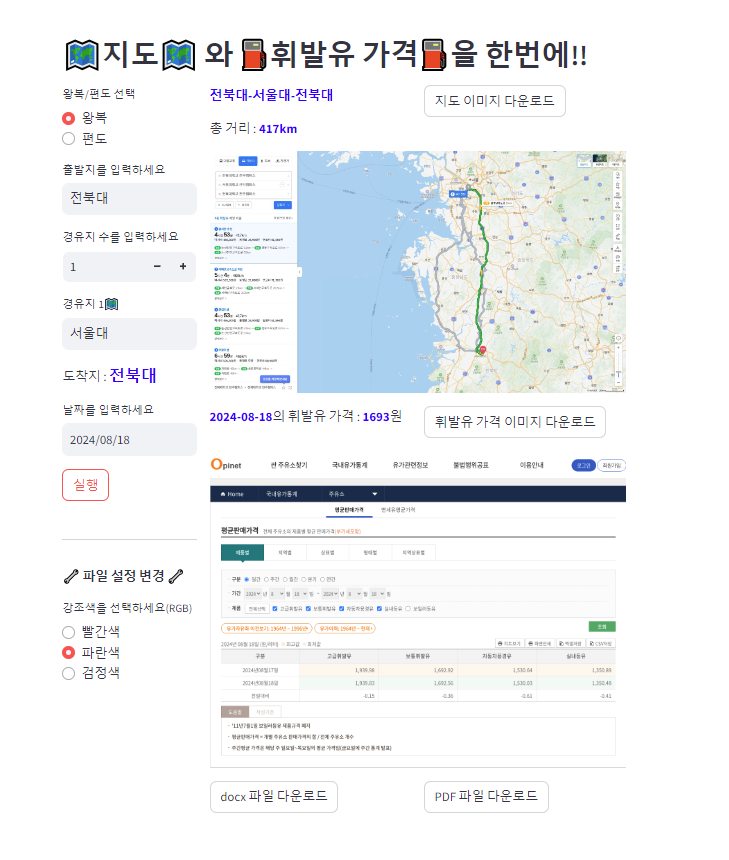

출장 처리할 때 필요한 여비증빙파일 자동화 사이트!!

현재 구동중인 웹사이트 주소 : http://web01.taegon.kr:6800/  
만약 안된다면 깃허브 : https://github.com/Yanghuiwon22/oilprice_navermap 를 실행

## 사용법
1. 왕복/편도 선택 후 출발지, 경유지, 도착지를 입력한다
2. 기름 가격을 알고 싶은 날짜를 선택한 후 실행 
   (파일에서 강조하고 싶은 텍스트의 색상을 선택할 수 있다.)
3. 파일 생성이 완료될 때까지 기다린 후 다운로드한다. (pdf/docx)

## 제작 기간 + 참여인원
- 1차 : 2024년 7월 19일 ~ 2024년 8월 19일 + 2인 (양희원, 김미소)

## 사용 기술
- Python : 크롤링, docx, pdf 파일 생성
- Streamlit : 웹사이트롤 제공하기 위해 사용
- Selenium : 네이버지도, 오일가격 크롤링

[//]: # (## ERD)

[//]: # (![ERD]&#40;../assets/img/portfolio/oilprice_navermap_3.png&#41;)

## 핵심 기술
- Selenium을 이용한 네이버지도, 오일가격 크롤링
- Streamlit을 이용한 웹사이트 제공
- docx, pdf 파일 생성

## 느낌점
- 이전 수업에서 도커를 사용한 적이 있으나, 아직 익숙하지 않음에서 많은 어려움이 발생하였다.
  (--> 이해가 가지 않는 부분을 찾아보면서 공부하여 해결하였다 > 아는 부분이 거의 없었다.)
- volumes을 사용해보면서 경로에 대한 이해도가 높아졌다.
  (--> 경로를 잘못 설정하여 오류가 났었다. 도커 시스템에 대해 공부하며 문제를 해결하였다.)
- selenium을 로컬에서 돌리는 것까진 괜찮았으나, 서버에서 돌리면서 문제가 발생하였다.
  처음에는 서버에는 모니터가 없기 때문에 문제가 발생하는 지 모르고 오류를 계속 찾아보다가
  교수님께서 지나가다가 보고 말씀해주신 후로 문제를 해결하였다.
  (--> 서버에서 돌릴 때는 headless를 사용하여야 한다는 것을 알게 되었다.)
- 이 서비스를 사용자가 어떻게 하면 사용하기 쉬울까 고민하면서 만들었는데, 생각보다 신경써야 하는 디테일
들이 많아서 시간이 많이 걸렸다.

## 서비스 화면

## 관련 블로그
