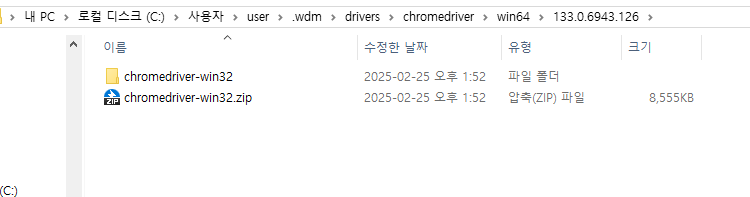

크롤링을 이용하여 네이버 날씨를 대시보드에 추가하고자 한다.

### 문제상황&해결방안
대시보드에 날씨 정보를 추가하려고 한다. 공공데이터포털의 api 서비스를 이용하려고 했으나, 데이터 업데이트 간격이 1시간이었다.
5분 정도의 정밀한 데이터를 원했기에 네이버 날씨를 활용하고자 한다. 

**네이버 날씨 사용의 이점**
- 미세먼지, 초미세먼지 정보 한번에 수집 가능
- 날씨 요약 정보(구름, 맑음 등) 파악 가능

### 핵심코드&해결과정
#### selenium을 통한 크롤링 진행 <br>
[오류] 드라이버 로드 실패
```text
selenium.common.exceptions.NoSuchDriverException: Message: Unable to obtain driver for chrome; For documentation on this error, please visit: https://www.selenium.dev/documentation/webdriver/troubleshooting/errors/driver_location
```
- 드라이버 경로가 잘못 잡혀있어 다운로드 후 진행 -> 해결 안됌. 
- 크롬과 크롬 드리이버 버전 확인 --> 일치
==> 도데체 왜 안되는것인가??
자동으로 크롬 버전 확인 후 드라이버 설치하는 도구 사용 --> 해결
```python
!pip intall webdriver-manager

from webdriver_manager.chrome import ChromeDriverManager
service = Service(service=Service(ChromeDriverManager().install()))
```
그렇다면 코드를 실행할 때마다 크롬 드라이버를 설치하는 것인가?
==> 아니다. 이전 버전과 동일한 크로 드라이버를 사용할 경우, 로컬 캐시를 사용한다 (즉, 버전이 바뀌면 알아서 맞게 바뀐다)

설치가 되는 위치는 (윈도우 기준) .wdm 폴더를 사용한다 (캐시 저장소)

(확인 해보니 실제로 존재!)

### 참고링크
항상 나의 손과 발이 되어주는 chatgpt에서 감사드린다.

